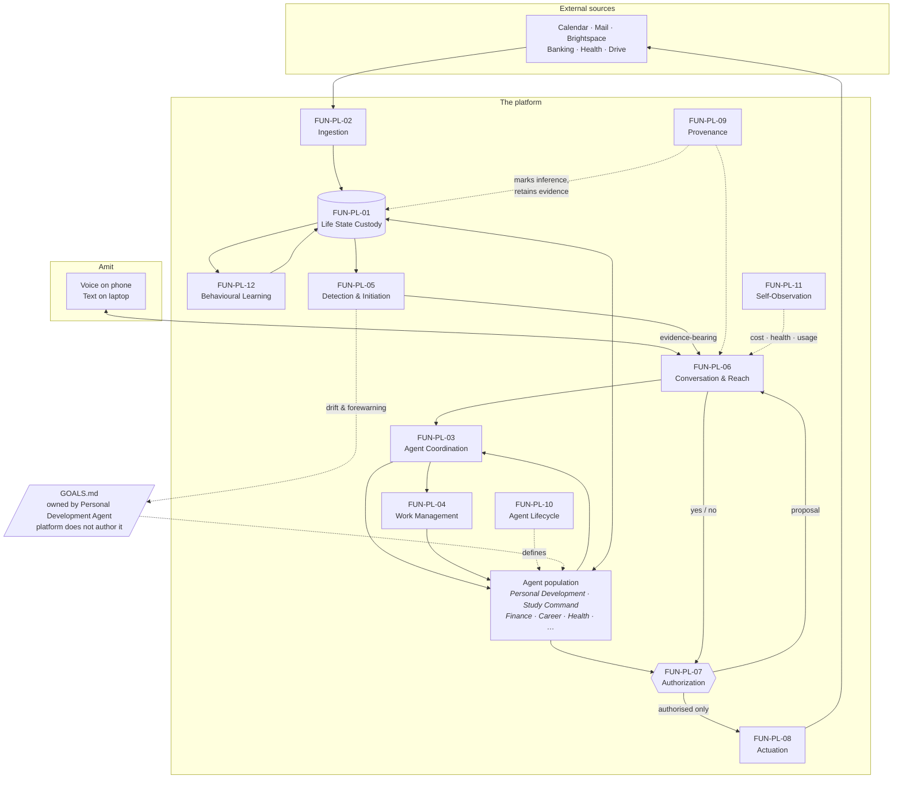

# Functional flow — product level

**Not an architecture.** No component, technology or deployment is implied here.
This shows the functions from `functions.csv`, the system boundary, and how work
moves between them. Architecture comes after the functional decomposition is agreed.

## What the diagram asserts

**`FUN-PL-01` is the hub.** Every agent reads the same life state. This is the
single change that makes the suite harmonic, and `REQ-PL-001` states it.

**Actuation is reachable only through authorization.** There is no path from an
agent to the outside world that bypasses `FUN-PL-07`. That is `REQ-PL-014` drawn
as topology rather than trusted to behaviour.

**Detection reads state, never sources.** `FUN-PL-05` sits downstream of custody,
so a proactive message cannot be raised on data that has not been reconciled
against what is already known. This is what prevents the stated abandonment
behaviour — being reminded of something already overridden (`REQ-PL-001`).

**`GOALS.md` sits outside the platform.** The platform serves it and reports drift
against it; the Personal Development Agent owns it (`REQ-PL-019`).

**Provenance and lifecycle are dotted.** They act on everything rather than
sitting in the flow of work.

## What it does not yet settle

- Whether agents execute inside the platform or attach from outside (`DEC-002` proposes both, by runtime).
- Whether life state is one store or several.
- Where the master copy of `GOALS.md` lives (`OPN-006`).
- Who arbitrates cross-domain contention (`OPN-005`).
